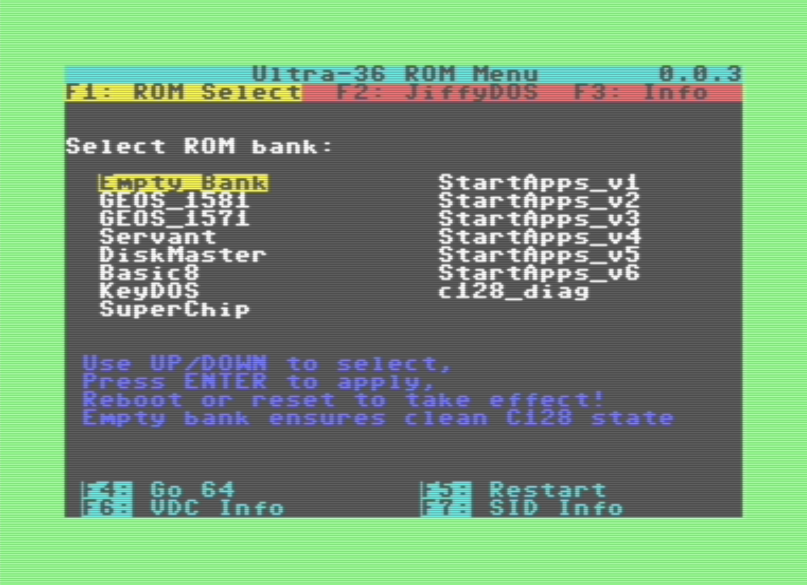
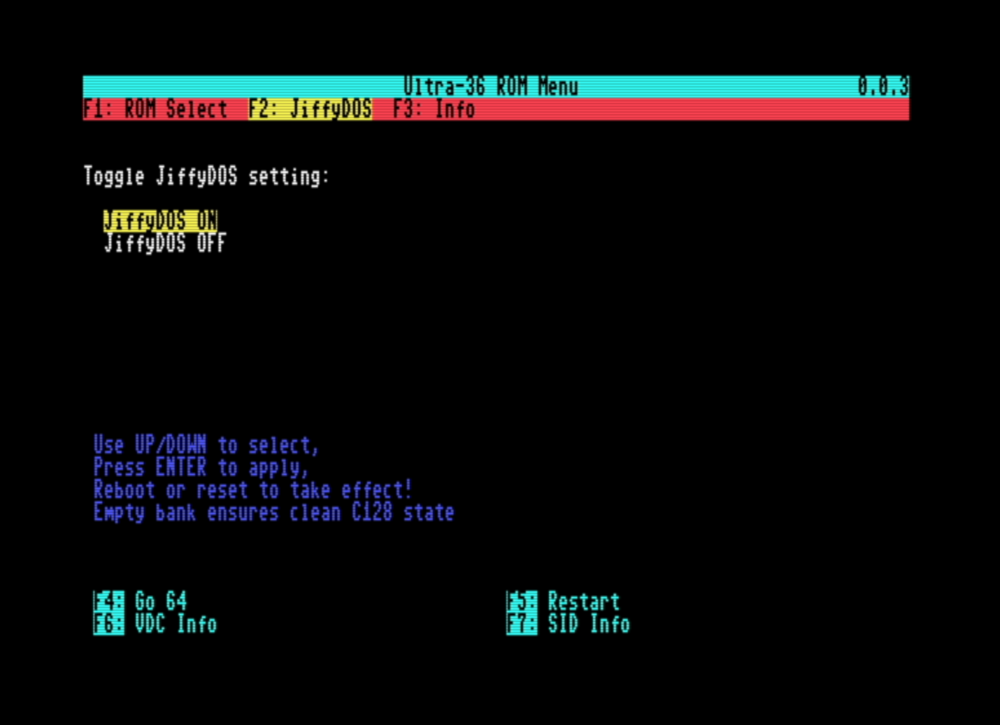
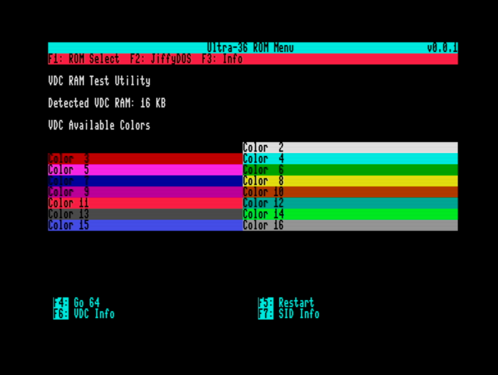
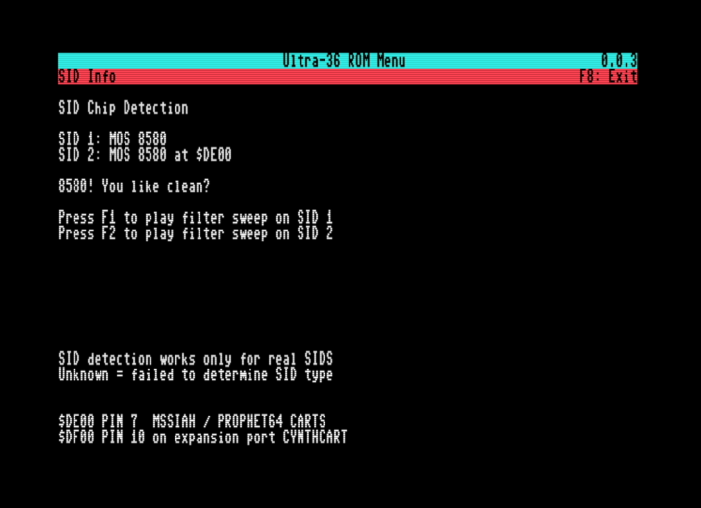

```
//   _____  ___________              _______________
//   __  / / /__  /_  /_____________ __|__  /_  ___/
//   _  / / /__  /_  __/_  ___/  __ `/__/_ <_  __ \
//   / /_/ / _  / / /_ _  /   / /_/ /____/ // /_/ /
//   \____/  /_/  \__/ /_/    \__,_/ /____/ \____/
// Ultra-36 Rom Switcher for Commodore 128 - C128 Menu Program
// Free for personal use.
// Commercial use or resale (in whole or part) prohibited without permission.
// (c) 2025 Lukasz Dziwosz / LukasSoft. All Rights Reserved.
```

### Ultra-36 C128 Function ROM Menu ###

Ultra-36 is a Commodore 128 internal function ROM system that allows up to 16 selectable ROM banks (each 16KB or 32KB). 16KB must be padded to 32KB. 

This project provides a bootable function ROM that displays a menu for selecting and identifying your ROMs, including support for a JiffyDOS toggle option.

Menu program built entirely in the CC65 toolchain, this system provides a robust, customizable launcher for embedded ROMs.

⸻
Screenshots






Project Structure
```
Ultra36MenuRom/
├── build/               # Output: compiled ROM binary
├── cart128_16/          # Startup code & config for 16K function ROM
├── cart128_32/          # (Optional) 32K version (same menu code)
├── src/                 # C source code (menu and logic)
├── Makefile             # Build and run automation
└── README.md            # This file
```
Requirements
	•	CC65 compiler toolchain (must be in your PATH)
	•	VICE emulator with x128
	•	macOS/Linux or WSL (Windows) with GNU make

⸻

Building and Running

This repository will contain default compiled bin file in the build folder, you need to combine this with other roms listed in the Makefile.
Burn into recommended Flash Eprom. (SST39SF040 16x32KB Banks, SST39SF020A 8x32KB Banks) Note that Menu program will only switch rom banks with Ultra-36 board for U36 socket in Commodore 128.

To compile and run the ROM directly in VICE C128 emulator (MacOs/Linux):
* Windows check Makefile for comments, you need to provide path to WinVice.
```
make run
```
This:
	•	Compiles src/main.c and startup files
	•	Produces build/cart128_16.bin or cart128_32.bin (set in Makefile)
	•	Launches x128 with the ROM attached as a function ROM

To only build the ROM:

make

To clean build artifacts:

make clean

Customizing ROM Bank Labels

To change the user ROM names shown in the menu, edit the DEFS section of the
Makefile. Bank 0 contains the menu program and Bank 1 is always the essential
`Empty_Bank`; both are fixed and are not part of this list.

DEFS = -DUSER_ROM_NAMES_INIT='"GEOS_1581","GEOS_1571","Servant","DiskMaster","Basic8","KeyDOS"' \
    -DNUM_USER_ROMS=6

### For 16-bank version:
 DEFS = -DUSER_ROM_NAMES_INIT='"GEOS_1581","GEOS_1571","Servant","DiskMaster","Basic8","KeyDOS","SuperChip","StartApps_v1","StartApps_v2","StartApps_v3","StartApps_v4","StartApps_v5","StartApps_v6","c128_diag"' \
     -DNUM_USER_ROMS=14

Use exactly 6 labels for an 8-bank image or 14 labels for a 16-bank image.
`Empty_Bank` is hardcoded as the first selectable menu entry. The corresponding
physical Bank 1 must still be filled with an empty 32KB image to ensure clean
boot and compatibility with external cartridges.

Use short names (6–10 characters) and escaped quotes as shown.

### Online builds

The `Build online menu ROM` GitHub Actions workflow can be started manually or
through the GitHub workflow-dispatch API. It accepts:

- `request_id`: an optional website correlation ID
- `bank_count`: `8` or `16`
- `names_json`: a JSON array containing exactly 6 or 14 user ROM names

For example, an 8-bank build uses:

```json
["GEOS_1581", "GEOS_1571", "Servant", "DiskMaster", "Basic8", "KeyDOS"]
```

Names are limited to 16 printable ASCII characters. The workflow generates a
temporary header, builds Bank 0 as `ultra36_32.bin`, verifies that it is exactly
32KB, and uploads the binary plus its SHA-256 checksum as a one-day artifact.
`Empty_Bank` is added by the firmware and must not be included in `names_json`.

⸻

How It Works
	•	ROM code is placed at $8000–$BFFF (16K) or $8000–$FFFF (32K)
	•	Uses the C128 MMU to enable external cartridge bank
	•	Includes an interactive menu (arrow keys + enter)
	•	Optionally supports a JiffyDOS toggle in the UI
	•	Sends framed, CRC-checked commands using CIA2 PB0/PB1 on User Port pins C/D
	•	All written in C and CC65 ASM using CC65 libraries

The final output cart128_16.bin can be:
	•	Flashed to SST39SF020A, SST39SF040 or similar EEPROMs
	•	Attached as a Generic C128 Function ROM in VICE
	•	Go to File > Attach cartridge image > Generic cartridge → Function ROM

🧑‍💻 Credits

Created as part of the Ultra-36 internal ROM selector project.

Designed to be simple, customizable, and expandable.


